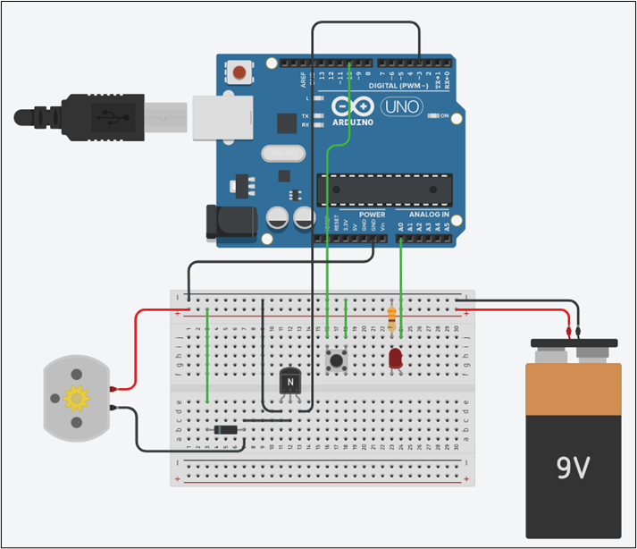

# マイコン基礎及び演習期末レポート

<div style="text-align: center;">
19EC043 蔡晟輝
</div>

## 1.テスト問題
           
次の回路を実現しなさい。
(1)停止状態：LED が 5 秒毎に点滅する
(2)高速状態：スイッチを押すと、LED は 0.5 秒毎に点滅する。モータは高速に回転する。
(3)低速状態：5秒後に、LED は 2 秒毎に点滅するようになり、モータは低速に回転する。
さらにスイッチを押すと、停止状態になる。

以上の(1),(2),(3)をそれぞれモード1、モード2、モード3とする。

## 2.使用した部品

| 使用したもの | 属性 | 数量 |
| :--- | :---: | :---: |
| ブレッドボード | - | 1 |
| ジャンパー線 | - | 数本 |
| Arduino Uno R3 | - | 1 |
| 電池 | 9V | 1 |
| DCモータ | - | 1 |
| 抵抗 | 330Ω | 1 |
| LED | 赤色 | 1 |
| スイッチボタン | - | 1 |
| ダイオード | - | 1 |
| NPNトランジスタ | - | 1 |

## 3.回路図

回路図は以下の図のようになる。



<div style="text-align: center;">
図1. 回路図
</div>

## 4.プログラム
```c++
const byte led = A0;
const byte motor = 3;
const byte btn = 10;
volatile int mode = 1;

void setup() {
 //pin設定
 pinMode(led, OUTPUT);
 pinMode(motor, OUTPUT);
 pinMode(btn, INPUT_PULLUP);
}
  
void btn_hantei() {
 //ボタン押されたかを判定するメソッド
 //もし押されたら、mode 1→2 or 3→1
 if (digitalRead(btn) == LOW) {
 if (mode == 1) {
 mode = 2;
 delay(50);
 }
 else if (mode == 3) {
 mode = 1;
 delay(50);
 }
 }
}
  
void loop() {
 //mode判定してどのように動くかを決める

 //モード1：5秒毎点滅
 if (mode == 1) {
 digitalWrite(motor, LOW);
 digitalWrite(led, HIGH);
 for (int i = 0; i < 50; i++) {
 delay(100);
 btn_hantei();
 if (mode != 1)break;
 }
 digitalWrite(led, LOW);
 for (int i = 0; i < 50; i++) {
 delay(100);
 btn_hantei();
 if (mode != 1)break;
 }
 //モード2：0.5秒毎に点滅、モータは高速回転
 } else if (mode == 2) {
 analogWrite(motor, 255);
 for (int i = 0; i < 5; i++) {
 digitalWrite(led, HIGH);
 delay(500);
 digitalWrite(led, LOW);
 delay(500);
  
 }
 //自動でモード3に切り替わる。
 mode = 3

 //モード3：2秒毎点滅、モータは低速回転
 } else if (mode == 3) {
 analogWrite(motor, 80);
 digitalWrite(led, HIGH);
 for (int i = 0; i < 20; i++) {
 delay(100);
 btn_hantei();
 if (mode != 3)break;
 }
 digitalWrite(led, LOW);
 for (int i = 0; i < 20; i++) {
 delay(100);
 btn_hantei();
 if (mode != 3)break;
 }
 }
}
```

## 5.プログラムの説明

まず、ledを制御するピンをA0、モータを制御するピンを3、ボタンを制御するピンを10にする。グローバル変数modeを作り、初期値を1にし、これはモードを表す。次に、void setup()で、led、モータ、ボタンのpin設定をする。void loop()の中に実際の動作をするコードを記述する。

void setup()の次は、btn_hanteiという関数を作り、これはdigitalRead(btn)がLOW、つまりボタンが押されたら、中身のコードが実行される。modeが1だったらmodeに2を代入する。modeが3だったらmodeに1を代入する。こうすることでボタンを押すたびにmodeが変わり、modeを判定すれば度の動作をするのかを決められる。

次のvoid loop()では、modeが1ならledをつけて、for文の中にdeley関数を記入したが、合計5秒経てばledを消灯し、同じように5秒待つ。また、deleyを一回で書かず、for文の中で記述するのは、短い間隔で（今回は100ms）ボタン判定をしたいためである。deley(5000)で書くと、待ち時間中にボタン押しても、btn_hantei関数が実行されない。ということでfor文の中にbtn_hantei()を書き、またもしbtn_hantei()によってmode変数が変われば、breakでループを抜け出し、void loop()の中にあるのでvoid loop()の頭からもう一回実行する。

modeが2ならanalogWrite(motor, 255)でモータを全力回転し、for文を使って5秒間0.5秒の点滅をさせる。またこの場合、mode変数の変更はbtn_hantei()関数で行わずに、そのままmodeに3と代入すれば、void loop()の次のループでmode3のプログラムが実行される。

modeが3ならanalogWrite(motor, 80)で低速回転し、同じようにfor文を使って2秒毎点滅をする。

## 6.考察

(1) Arduinoでモータを使う場合、Arduinoのデジタルピンの電圧では0〜5Vまで出力できるので、モータに必要な電圧はクリアしているが、Arduinoの仕様上、デジタルピンの電流は40mAになっていて、モータにかかる電流はこれを超えるため、モータをArduinoに直接つなげてはならず、ほかの電源が必要になる。今回は電池を使用した。

(2) 回路を単純にするため、モータドライバを使用せず、ダイオードとトランジスタを使用した。ダイオードは電流を逆方向に流さない、整流の効果があり、安全のために使用し、トランジスタで電気の流れを制御する。また今回はモータの速度を制御したいので、PWM制御を使う。これはトランジスタやFETなどの半導体スイッチで高速にオンとオフを繰り返し、オンとオフのパルス幅を変化させることで電圧を変える方式で、analogWrite(pin, value)と書くことで、HIGHやLOWの2パターンしか指定できないいつものやり方より、細かく設定できる。valueには0～255を指定でき、これはデューティ比ともいうが、0では0V、255では対応する最大な電圧を出力する。つまり255に指定するとモータが最大な速度で回転することになる。

(3) LEDに抵抗をつなげているが、これはLEDを直接ポートに接続すると、Arduinoのポートから出力される5Vに対する電流が目いっぱいながれてしまい、LEDが壊れる恐れがあるため。

(4) 今回のボタンを押す判定は、digitalRead(btn) == LOWを判定しているが、btn_hantei関数の中にdelay(50)が書かれているが、これがないと実はボタンを押すたびmode変数が正しく切り替われなくなる。これはスイッチのチャタリングによって短い時間内で何回もボタンを押したような感じになり、不具合が起きるためである。そこでdelay(50)を付け加えることで、わずかの時間を待つので、スイッチのチャタリングを防止することができたと考えられる。

## 7.反省

ボタンを押したときの判定において、今回は簡単にdigitalRead(btn) == LOWを使用して書いたが、授業中でやったような判定方法を使えば、もっと正確に動作できたと思われる。（delay(50)がいらなくなるため）また、それによってdelayをfor文の中に書かなくてもうまくいくと思われる。まだまだプログラムをシンプルにでき、改善点があると感じた。

